# 🍽️ Culinary Canvas – Traditional Recipe Sharing Platform

## 📌 Overview
Culinary Canvas is a modern web-based platform designed to preserve and share India's rich culinary heritage.  
Users can explore traditional recipes, contribute their own dishes, and engage with a community of food lovers.

---

## 🌐 Live Demo
🔗 https://recipe-sharing-website-one.vercel.app/

---

## 📂 GitHub Repository
🔗 https://github.com/rahulkumar2112k/Recipe-sharing-website

---

## ✨ Features

- 🔍 Search recipes by dish or state  
- 🗺️ Explore recipes state-wise across India  
- 📝 Add and share your own recipes  
- ⭐ Rating and review system  
- ❤️ Like and share recipes  
- 📸 Recipe details with ingredients & steps  
- 🌙 Dark mode UI for better experience  

---

## 🖼️ Screenshots

### 🏠 Home Page
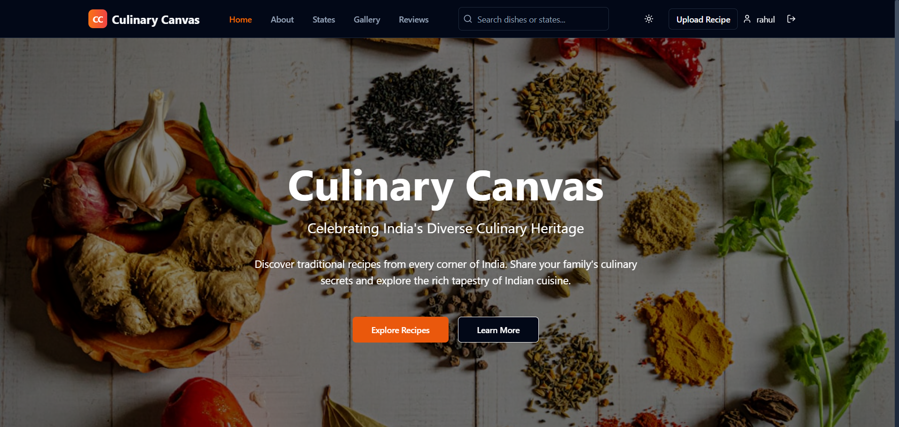
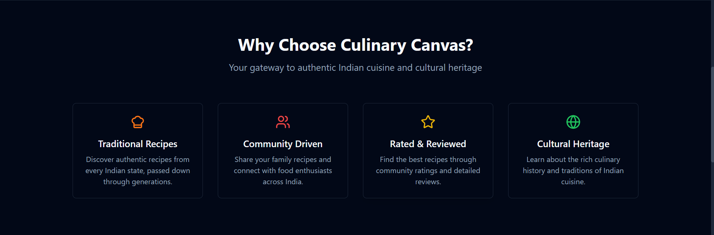
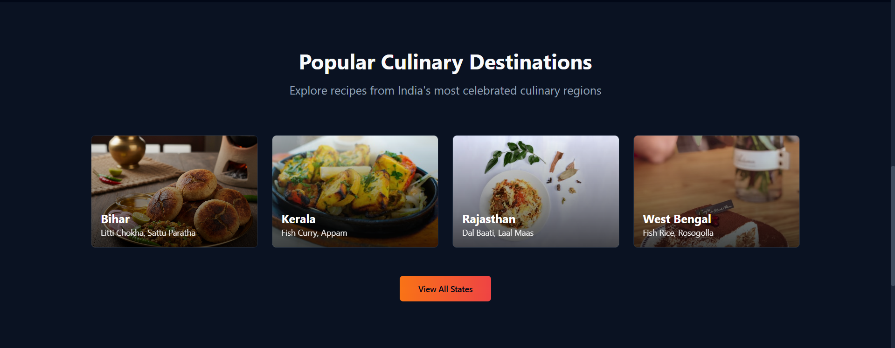
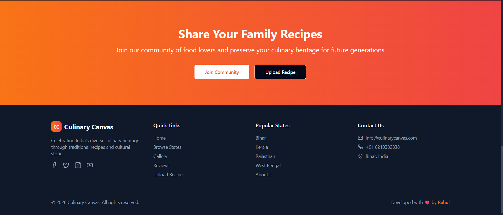

### 📖 About
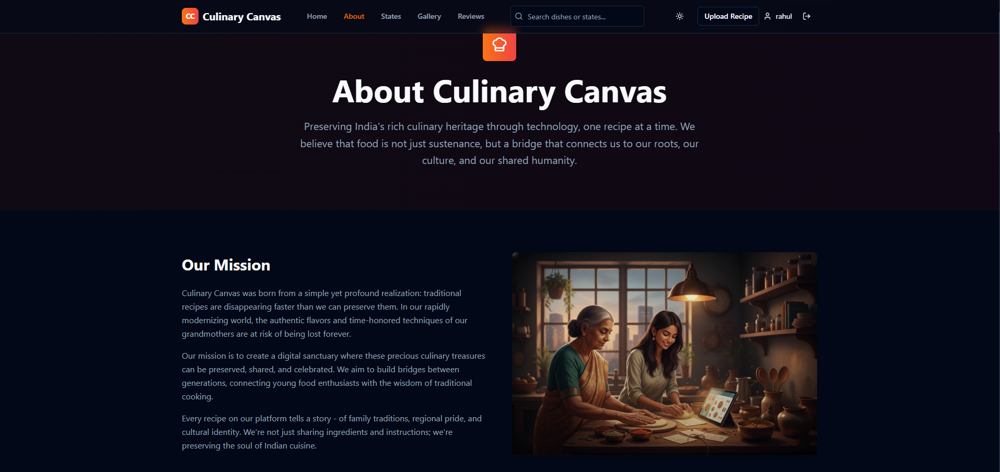
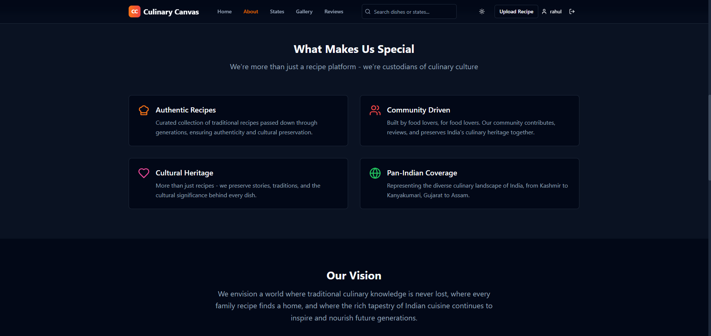
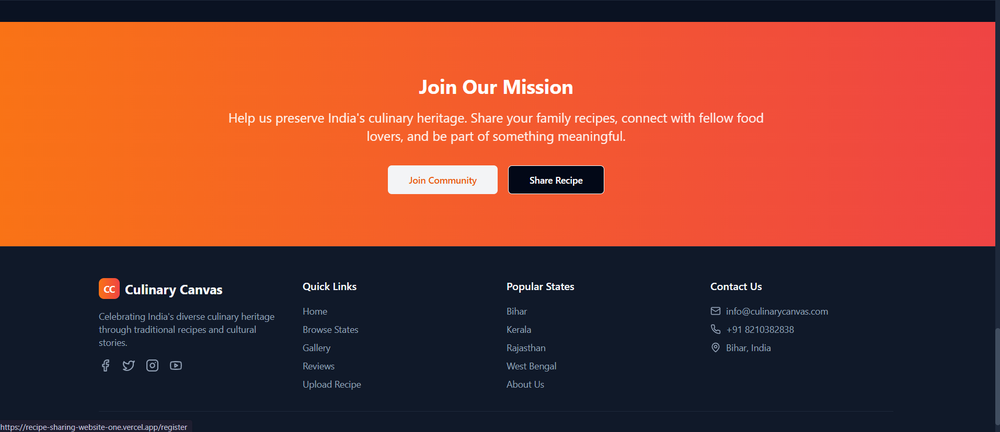


### 📍 Explore States
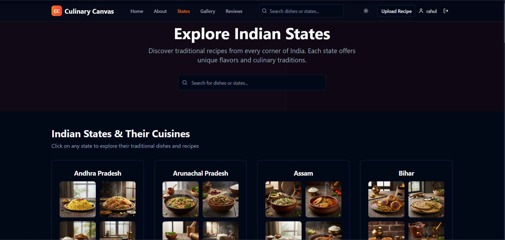


### 🍛 Recipe Details
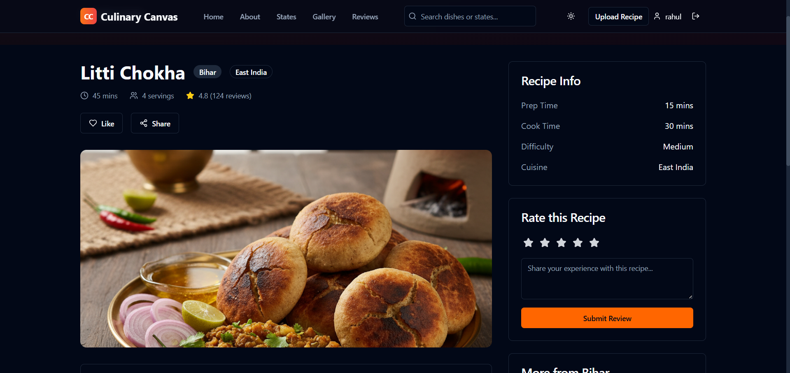
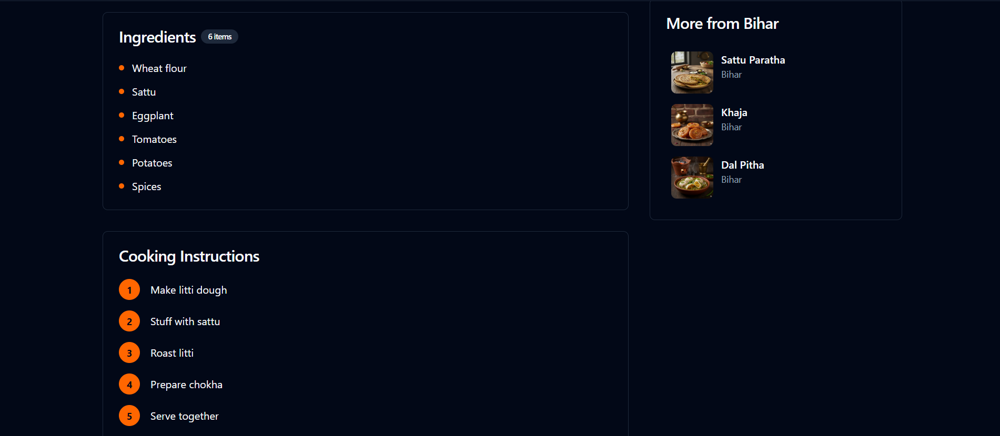

### ⭐ Reviews Section
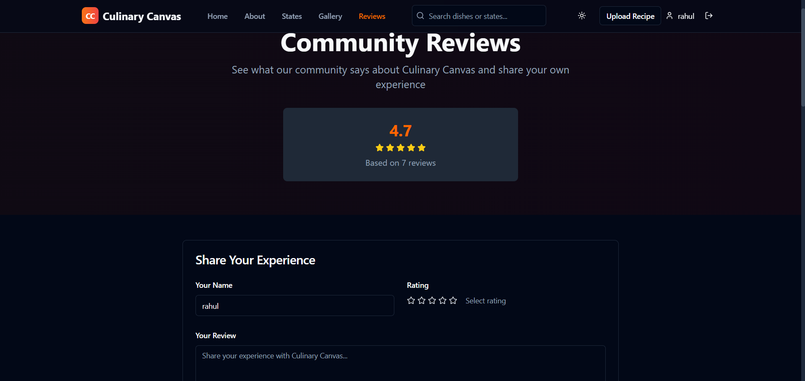
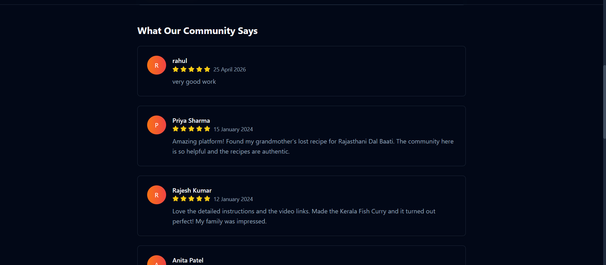

### ➕ Add Recipe
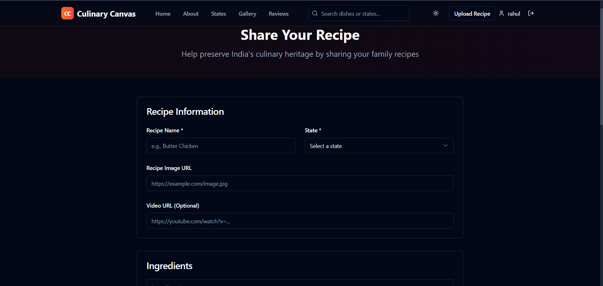
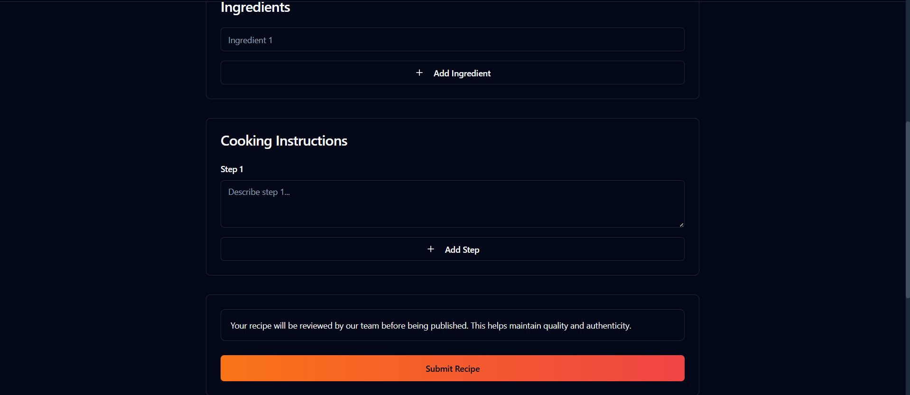


---

## 🛠️ Tech Stack

- **Frontend:** React.js, TypeScript  
- **Styling:** CSS3  
- **State Management:** Context API  
- **Build Tool:** Vite  
- **Deployment:** Vercel  

---

## ⚙️ Installation & Setup

```bash
# Clone the repository
git clone https://github.com/rahulkumar2112k/Recipe-sharing-website.git

# Navigate into the project
cd Recipe-sharing-website
cd frontend 
npm run dev 
